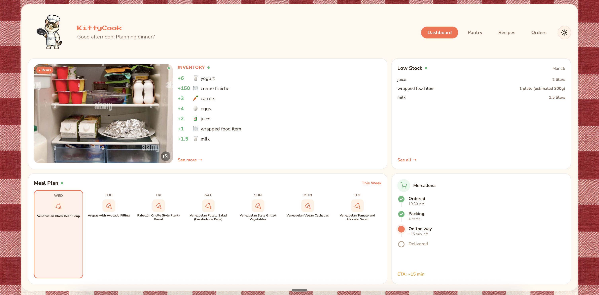

# KittyCook Frontend

Your AI-powered kitchen companion. Chat with Bobby on Telegram to manage your pantry, plan meals, and order groceries — all visualized in a real-time dashboard.

## Screenshots

### Dashboard
Live inventory from fridge photos, weekly meal plan, low-stock alerts, and delivery tracking — all updated in real time via SSE.



### Telegram Onboarding
Send a fridge photo to Bobby on Telegram. He detects your ingredients, asks about allergies and preferences, then generates a personalized weekly meal plan.


## Stack

- **React 19** + TypeScript
- **Vite** for dev/build
- **Tailwind CSS** + CSS variables for theming (day/night mode)
- **Framer Motion** for animations
- **SSE** (Server-Sent Events) for real-time updates from the backend

## Getting Started

```bash
npm install
npm run dev
```

Opens at [http://localhost:5173](http://localhost:5173).

Set `VITE_API_URL` in `.env` to point to the backend (defaults to the Railway deployment).

## Features

- **Fridge scan** — photo-based inventory detection via Telegram
- **Pantry management** — search, filter, AI-generated food icons
- **Meal planning** — weekly view with skip/cook toggling
- **Recipe discovery** — AI-generated suggestions from your pantry
- **Grocery ordering** — browser agent shops Mercadona, streams live progress
- **Order tracking** — delivery timeline with ETA
- **Day/Night mode** — chef Bobby by day, delivery Bobby by night
